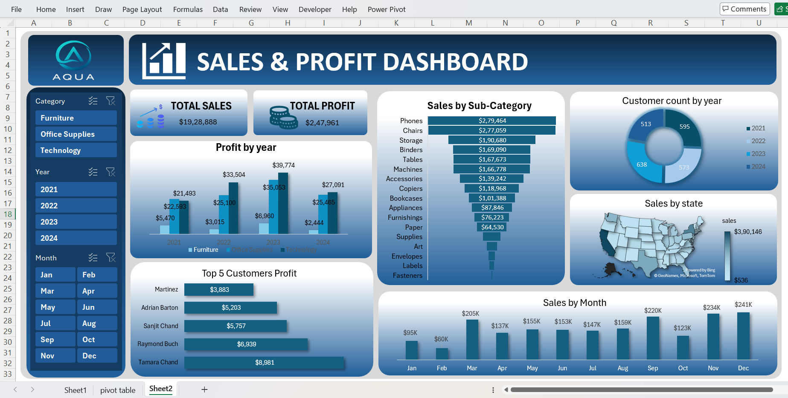

# Sales & Profit Excel Dashboard

An interactive Excel dashboard analyzing sales and profit performance across categories, states, customers, and time — built using Pivot Tables, Pivot Charts, and Excel formulas to deliver dynamic business insights.

---

## Dashboard Preview

---

## Key Highlights

- **8,314 orders analyzed** across 2021–2024 covering 3 categories and 49 US states
- **$1.93M Total Sales** and **$247K Total Profit** tracked across all years
- **789 unique customers** analyzed across the dataset
- **Top 5 Customers by Profit** — Tamara Chand, Raymond Buch, Sanjit Chand, Adrian Barton and more
- **Monthly trends** — December, November and September are the strongest months
- **State-level analysis** — California leads with $390K, followed by New York ($246K) and Texas ($151K)

---

## Dashboard Sections

| Section | What It Shows |
|---|---|
|  Total Sales & Profit | $1.93M Sales, $247K Profit — overall KPIs |
|  Profit by Year | Furniture, Office Supplies, Technology profit split across 2021–2024 |
|  Sales by Sub-Category | Phones ($279K), Chairs ($277K), Storage ($190K), Binders ($169K), Tables ($167K) |
|  Sales by State | State-wise revenue across 49 US states |
|  Customer Count by Year | Yearly count of unique customers |
|  Top 5 Customers by Profit | Highest profit-generating customers |
|  Sales by Month | Monthly revenue trend |

---

## Key Insights

- **Technology** generates the highest profit ($121K) followed by Office Supplies ($108K) and Furniture ($17K)
- **Phones and Chairs** are the top revenue-driving sub-categories
- **California** dominates state-wise with $390K in total sales, nearly double second-place New York ($246K)
- **December, November and September** are the strongest months by revenue
- **Furniture** has the lowest profit margin despite having high-value products like Chairs and Tables

---

## Dataset

Dataset contains **8,314 orders** with the following fields:

- `Order Date`, `Customer Name`, `State`
- `Category`, `Sub-Category`, `Product Name`
- `Sales`, `Quantity`, `Profit`
- `Month`, `Year`

---

## Tools & Technologies

`Microsoft Excel` &nbsp;|&nbsp; `Pivot Tables` &nbsp;|&nbsp; `Pivot Charts` &nbsp;|&nbsp; `Excel Formulas` &nbsp;|&nbsp; `Data Visualization`

---

## Getting Started

1. Download `Sales_and_Profit-Excel_Dashboard.xlsx`
2. Open in **Microsoft Excel**
3. Navigate to the **Dashboard sheet** to explore interactive charts
4. Use slicers to filter by Year, Category, or State
